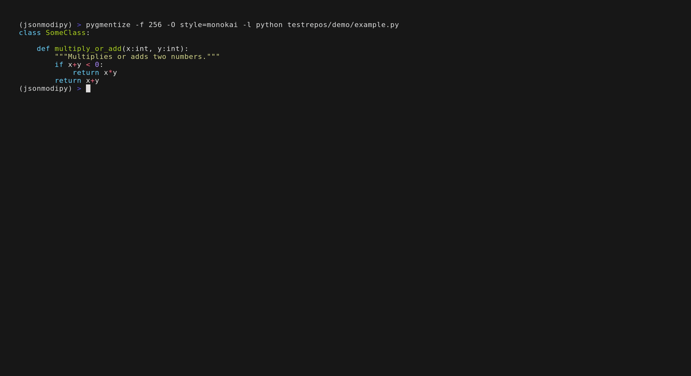

---
title: TUI
layout: template
filename: TUI.md
--- 
<html lang="en">
  <body>
    
    </body>
</html>

# Terminal User Interface - Demo
Below is a demo of the user interface that enables developers to quickly process, filter and apply the suggestions by the LLM for an entire codebase.

Additional gif with controls:

<video controls id="gif-video">
  <source src="TUI_demo.gif" type="video/gif">
  Your browser does not support the video tag.
  
</video>

again
<html>
  <body>
  <video controls id="gif-video">
  <source src="TUI_demo.gif" type="video/gif">
  Your browser does not support the video tag.
  
</video>
  

  </body>
</html>

Another retry.

